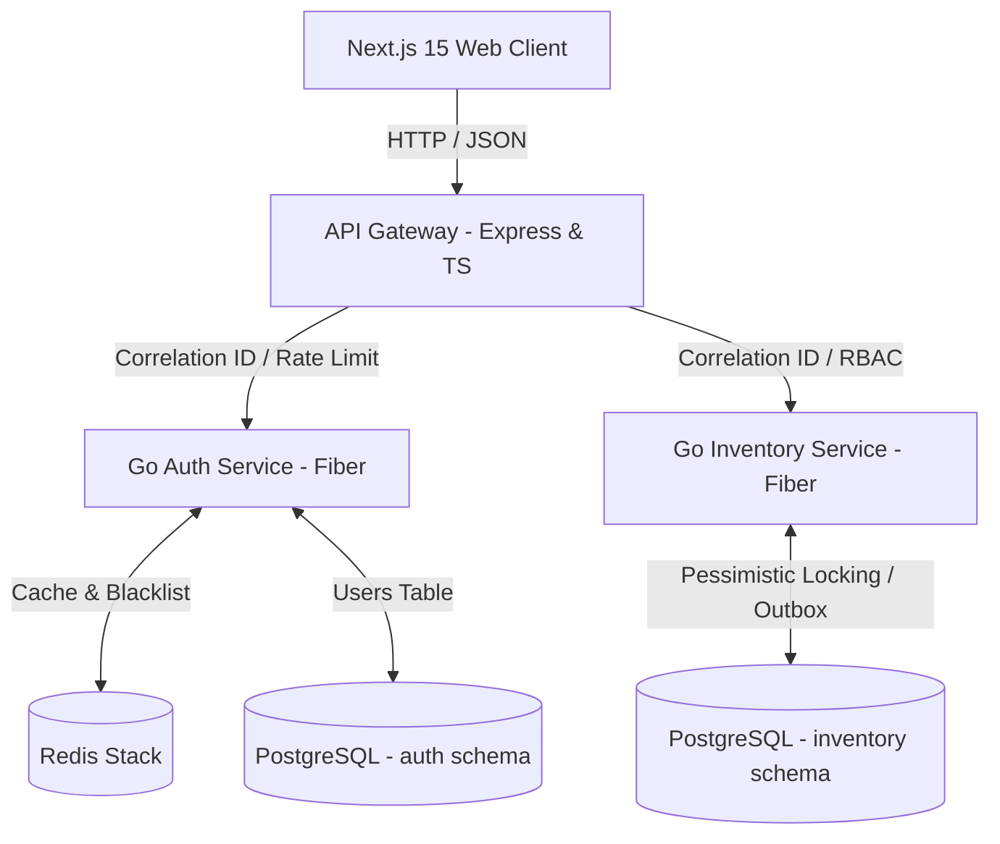

# Smart Manufacturing ERP & Supply Chain Intelligence Platform

A high-performance, enterprise-grade, event-driven microservices ERP designed to automate industrial manufacturing workflows, procurement pipelines, and financial ledgering. This platform utilizes an asynchronous, decoupled event loop to handle massive business transaction volumes with strict data consistency, transactional safety, and fault tolerance.

---

## 🏗️ Architectural Topology

The platform is designed around isolated service domains coordinated by a central API gateway and decoupled via an event broker:



### 1. API Gateway (Node.js & TypeScript)
Acts as the single entrypoint for the clients. It intercepts all incoming requests to perform:
- **Correlation ID Injection**: Traces requests across all microservices boundaries.
- **DDoS Mitigation**: Redis-backed sliding window rate limiter (100 req/min).
- **JWT Authorization**: Validates signature and queries Redis to block revoked/blacklisted sessions.
- **RBAC (Role-Based Access Control)**: Restricts access to service routes based on role metadata.

### 2. Authentication Service (Go, Fiber & GORM)
Provides secure session lifecycle management:
- Secure registration & login powered by `bcrypt`.
- Issues short-lived access JWT tokens and long-lived refresh tokens.
- Supports session revocation (logs out user by storing token `jti` in Redis with remaining TTL).

### 3. Inventory Service (Go, Fiber & GORM)
Manages product catalogs and warehouse stock levels:
- **Pessimistic Locking**: Executes `SELECT FOR UPDATE` inside GORM transactions to guarantee atomic adjustments and prevent race conditions.
- **Transactional Outbox**: Log changes to the `outbox_events` table in the *same* database transaction to ensure atomicity before forwarding events to the broker.

---

## 📂 Directory Layout

```
.
├── backend/
│   ├── cmd/
│   │   ├── iot-simulator/    # Go: 100-goroutine battery telemetry simulator
│   │   └── iot-worker/       # Go: Kafka consumer, spike detection, DB + alert publish
│   ├── pkg/                  # Shared Go libraries (Kafka Outbox)
│   └── services/
│       ├── auth/             # Go identity & session service
│       ├── inventory/        # Go product & stock manager
│       ├── procurement/      # Go automated purchasing service
│       ├── finance/          # Go double-entry ledger & invoicing
│       └── intelligence/     # Go demand forecasting service
├── docs/
│   └── iot_telemetry.md      # IoT pipeline deep-dive
├── frontend/                 # Next.js portal — dark industrial theme
├── gateway/                  # Node.js Express API Gateway + WebSocket hub
├── infra/
│   ├── kafka/topics.sh       # Topic provisioning (including iot.telemetry.battery)
│   ├── postgres/init/        # Database schemas & seeds for each domain
│   └── observability/        # Prometheus, Grafana, Loki, Jaeger, alert rules
├── docker-compose.yml        # Full stack: infra + gateway + IoT simulator + worker
└── README.md
```

---

## ⚡ Quick Start & Installation

### Prerequisites
- Docker & Docker Compose
- Node.js (v18+)
- Go (v1.22+)

### Step 1: Spin up local infrastructure
```bash
docker compose up -d
```
*Creates PostgreSQL (mapped to host port `5435`), Redis Stack (mapped to host port `6375` & UI `8005`), and MinIO (mapped to host port `9000`). All service schemas are automatically initialized.*

### Step 2: Initialize & run API Gateway
```bash
cd gateway
npm install
npm run build
npm run dev
```

### Step 3: Run the Microservices
Ensure you have the correct environments set up (refer to `.env` in the root).

**Auth Service:**
```bash
cd backend/services/auth
go run main.go
```

**Inventory Service:**
```bash
cd backend/services/inventory
go run main.go
```

### Step 4: Start the Frontend Portal
```bash
cd frontend
npm install
npm run dev
```
*Open [http://localhost:3000](http://localhost:3000) to access the ERP Operations Control Panel.*

---

## 🗺️ Core Project Roadmap

- **Phase 1: Foundation & Scaffold** (Completed)
  - Dockerized PostgreSQL/Redis/MinIO schemas and seeding.
  - Node.js gateway with RBAC, Correlation ID, and Redis rate limiter.
  - Go Auth and Inventory services.
  - Next.js 15 layout, Zustand store, and TanStack query components.
- **Phase 2: Event-Driven Broker Integration** (Completed)
  - Deployed Kafka and implemented the Outbox Pattern relay worker in Go.
  - Implemented Procurement Service reacting to stock level breaches with Idempotency guarantees.
- **Phase 3: Intelligence & Finance** (Completed)
  - Built predictive demand forecasting engine.
  - Generated PDF Invoices and uploaded them to MinIO.
  - Built strictly balanced double-entry ledger engine in Finance Service.
- **Phase 4: Observability & Resilience** (Completed)
  - Added Prometheus metrics collection via `fiberprometheus` and `express-prom-bundle`.
  - Added Promtail/Loki log aggregation.
  - Provided Grafana observability dashboards.
